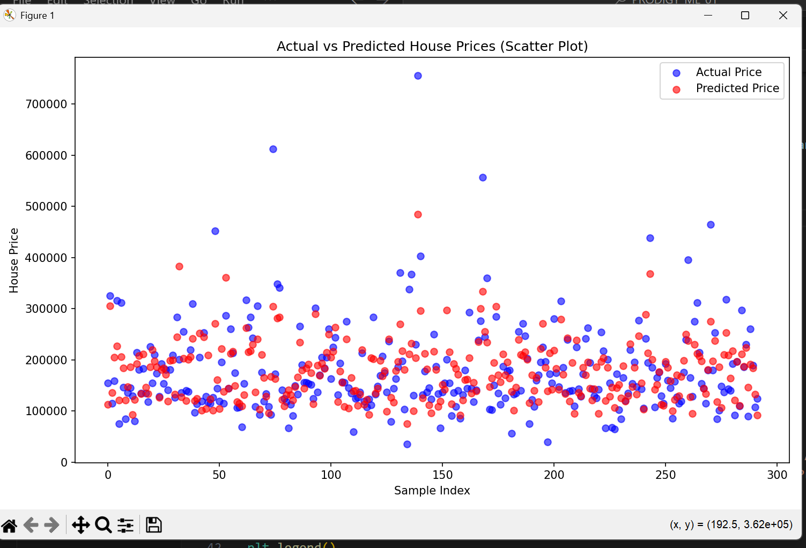
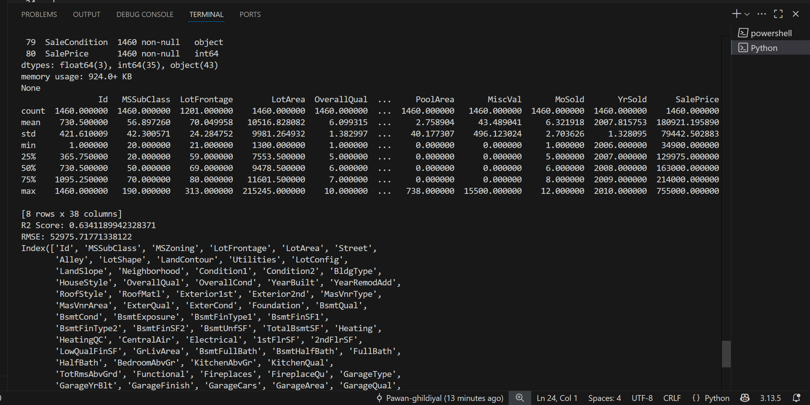

# 🏡 House Price Prediction – Prodigy ML Task 1

## 📌 Overview
This project is part of my internship with **Prodigy Infotech (Machine Learning Domain)**.  
The task was to **build a regression model to predict house prices** based on available features and evaluate its performance.

---

## ✨ Features
✅ Performed **data loading & exploration** using Pandas  
✅ Selected important numerical features (e.g., `GrLivArea`, `OverallQual`, `GarageArea`, etc.)  
✅ Built a **Linear Regression model** using scikit-learn  
✅ Visualized **Actual vs Predicted prices** on a graph  
✅ Calculated **R² Score** and **RMSE** to evaluate performance

---

## 📊 Results
- **R² Score:** `0.6341` 
- **RMSE:** `52975.7177` 

---

## 📈 Visualization
**Blue = Actual Prices**  
**Red = Predicted Prices**



---

## 💻 Terminal Run
Here’s a screenshot of the terminal run:  


---

## 🛠️ Tech Stack
- Python 🐍
- Pandas, NumPy
- Scikit-Learn
- Matplotlib

---

## 🚀 How to Run
1. Clone this repo:
   ```bash
   ## 🚀 How to Run

1. **Clone the repository**
   ```bash
   git clone https://github.com/Pawan-ghildiyal/PRODIGY_ML_01.git
   cd PRODIGY_ML_01
   pip install -r requirements.txt
   python task01.py

